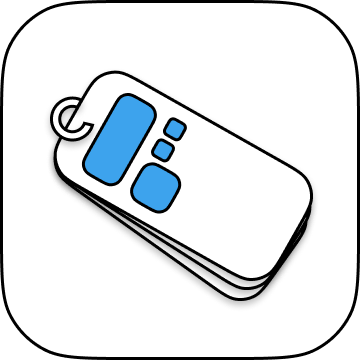

MemorizeWidget 暗記ウィジェット for iPhone, iPad
=============================================
 

 

AppStore link
-----------------
https://apps.apple.com/app/id1644276262

Description
---------------
Flashcard on widget. Memorize a note in everyday life.

- Two mode. \"One note mode\" or \"Random note mode\".
- In Random note mode, widget changes the note per 5 minutes.
- Lock screen widget support (iOS 16 only)
- Import file(e.g. tsv, csv, txt) or text.
- System dictionary support.
- Customizable search function.

### Option
- Show comment on widget. (homescreen-widget/lockscreen-rectangular)

* * *

Localization: All
-------------------
- English
- Japanese(native)

 

Source code link
------------------
https://github.com/FlipByBlink/MemorizeWidget

### Source code (Mirror) link
https://gitlab.com/FlipByBlink/MemorizeWidget_Mirror

Contact
------------
sear_pandora_0x@icloud.com

 
 

* * *

 
 
 
 

Privacy Policy for AppStore
----------------------------
2022-09-08

### Japanese
このアプリ自身において、ユーザーの情報を一切収集しません。

### English
This application don't collect user infomation.

 
 
 
 

* * *

 
 

<!-- URL "Support page for AppStore" -->
<!-- https://flipbyblink.github.io/MemorizeWidget/ -->

<!-- URL "Privacy Policy for AppStore" -->
<!-- https://flipbyblink.github.io/MemorizeWidget/#privacy-policy-for-appstore -->
